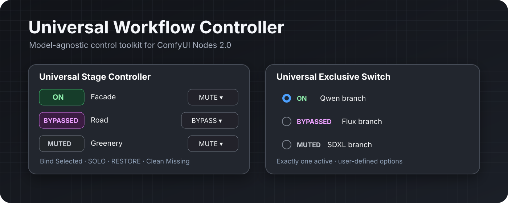
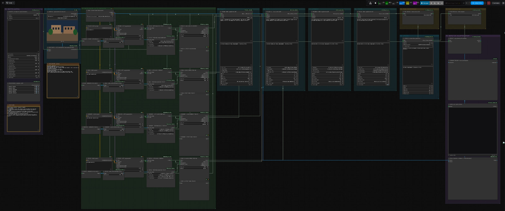
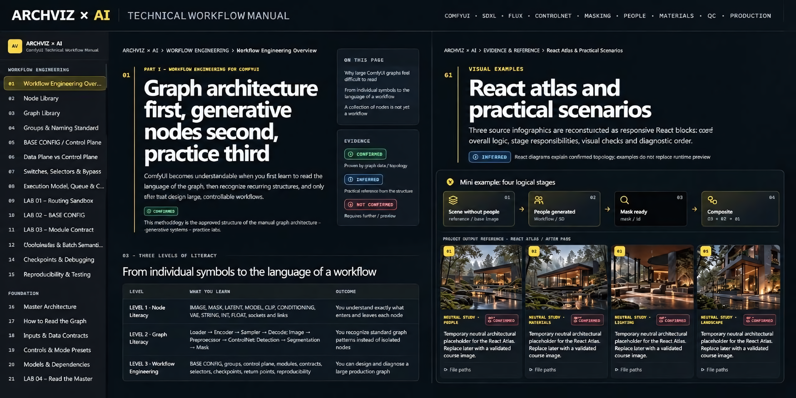
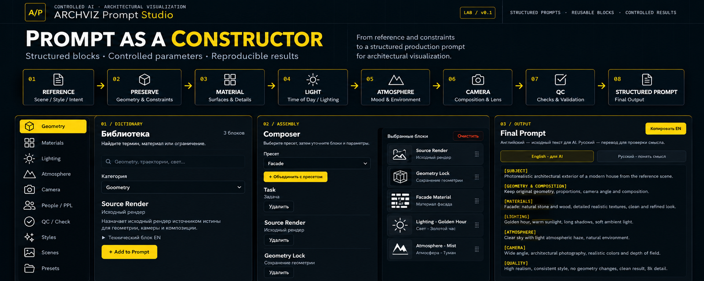

  

# Oleg Gorkov

### Architectural Visualization · Controlled AI Production · Workflow Engineering

**Building controlled, reproducible AI workflows for professional architectural visualization.**

I work at the intersection of **architectural visualization, AI-assisted production and workflow engineering** — developing systems that improve visual quality while preserving architectural geometry, camera, proportions and design intent.

**3ds Max / Corona → ComfyUI → Controlled AI Passes → QC → Final Delivery**

---

## Selected Work

### [ComfyUI Universal Workflow Controller](https://github.com/lutiy-dev/ComfyUI-Universal-Workflow-Controller)

**Model-agnostic workflow control for ComfyUI Nodes 2.0.**

  

Universal Stage Controller and Exclusive Switch for binding arbitrary nodes, Mute/Bypass control, SOLO/RESTORE, exclusive branch switching, persistence and missing-target recovery.

`ComfyUI` · `Nodes 2.0` · `Workflow Control` · `Frontend Extension` · `MIT`

**[View Repository](https://github.com/lutiy-dev/ComfyUI-Universal-Workflow-Controller)**

---

### [ARCHVIZ Geometry Guardian](https://github.com/lutiy-dev/ARCHVIZ-Geometry-Guardian)

**Architecture-preservation QC for AI-assisted architectural visualization.**

  

Geometry validation, Reference Passport, image-based evidence and explicit confidence/coverage for controlled AI production.

`Python` · `Computer Vision` · `Geometry QC` · `AI Production`

### [ARCHVIZ × AI · Technical Workflow Manual](https://github.com/lutiy-dev/Technical_Manual_UI)

**Production-focused ComfyUI workflow engineering for Architectural Visualization.**

  

Interactive bilingual PWA covering workflow architecture, SDXL, FLUX, ControlNet, masking, PEOPLE/PPL, diagnostics, practical labs and reproducible production methodology.

`ComfyUI` · `FLUX` · `SDXL` · `ControlNet` · `PWA`

**[Open Live Manual](https://lutiy-dev.github.io/Technical_Manual_UI/)** · **[View Repository](https://github.com/lutiy-dev/Technical_Manual_UI)**

---

### [ARCHVIZ · Prompt Studio](https://github.com/lutiy-dev/ARCHVIZ-Prompt-Dictionary-Builder)

**Bilingual structured prompt composer for controlled AI-assisted architectural visualization.**

  

Reusable prompt blocks, material/light/atmosphere presets, conflict checks and reproducible prompt assembly for production-oriented Archviz workflows.

`Prompt Engineering` · `Archviz` · `ComfyUI` · `PWA`

**[Open Prompt Studio](https://lutiy-dev.github.io/ARCHVIZ-Prompt-Dictionary-Builder/)** · **[View Repository](https://github.com/lutiy-dev/ARCHVIZ-Prompt-Dictionary-Builder)**

---

## Current Focus

**Geometry Preservation** · **Image-to-Image** · **Material Control** · **Automated Masking** · **People Integration** · **Final Polish** · **Production QC**

---

## Production Principle

### PRESERVE GEOMETRY → CONTROL THE CHANGE → VERIFY THE OUTPUT → MAKE IT REPRODUCIBLE

*AI is used as a controlled production layer — not as a replacement for architectural intent.*

---

## Production Stack

| | |
|---|---|
| **3D** | 3ds Max · Corona Renderer |
| **AI / Generative** | ComfyUI · FLUX · SDXL · ControlNet · SAM |
| **Engineering / QC** | Python · Computer Vision · GitHub |
| **Delivery** | PWA · GitHub Pages · Reproducible Workflows |

---

**Architectural Visualization × Controlled AI**

